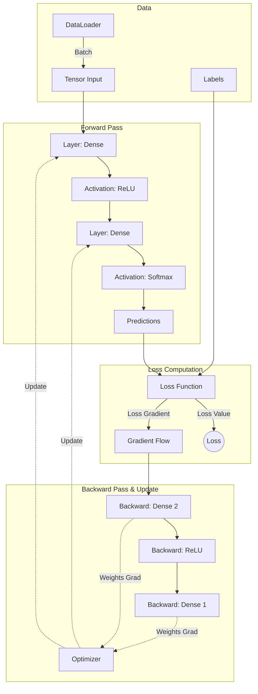

# Tardigrade Framework Concept & Architecture

## Overview
Tardigrade is an educational Deep Learning framework developed in modern C++17. It aims to provide a clear, understandable structure for studying the fundamentals of Neural Networks and 3D Vision, avoiding overly complex abstractions. The core mathematical operations are powered by `Eigen3`, providing high performance and zero-copy abstraction via `Eigen::Map`.

## Core Components
The framework is decomposed into several modular components:

- **Tensor**: A multi-dimensional data structure wrapping `std::vector` and `Eigen`.
- **Layer**: Computes the forward pass (dot products + biases) and backward pass (gradients).
- **Activation**: Non-linear functions (ReLU, Softmax) applied after layers.
- **Loss**: Objective functions (MSE, CrossEntropy) to evaluate predictions.
- **Optimizer**: Algorithms (SGD, Adam) for updating layer weights using gradients.
- **DataLoader**: Loads and parses data (e.g., MNIST) utilizing `OpenCV`.
- **Model**: Orchestrates the training loop, forward chaining, backward propagation, and parameter updates.

## Architecture & Data Flow

Below is the high-level architecture demonstrating the feed-forward and backpropagation cycles.

## Mathematical Foundations
The framework implements classical Deep Learning mathematics.

### Forward Propagation
For a Dense layer $l$ with weights $W^{(l)}$ and biases $b^{(l)}$ (often augmented into $W$ for simplicity):
$$ Z^{(l)} = X^{(l-1)} W^{(l)} $$
$$ A^{(l)} = \sigma(Z^{(l)}) $$
Where $\sigma$ is an Activation function.

### Backward Propagation
Using the Chain Rule, gradients are propagated from the output layer back to the inputs:
$$ \delta^{(l)} = \frac{\partial L}{\partial Z^{(l)}} = \left( \delta^{(l+1)} (W^{(l+1)})^T \right) \odot \sigma'(Z^{(l)}) $$
Weight gradients:
$$ \nabla W^{(l)} = (A^{(l-1)})^T \delta^{(l)} $$

These formulas are explicitly implemented within `Layer` and `Activation` classes to emphasize educational value.
